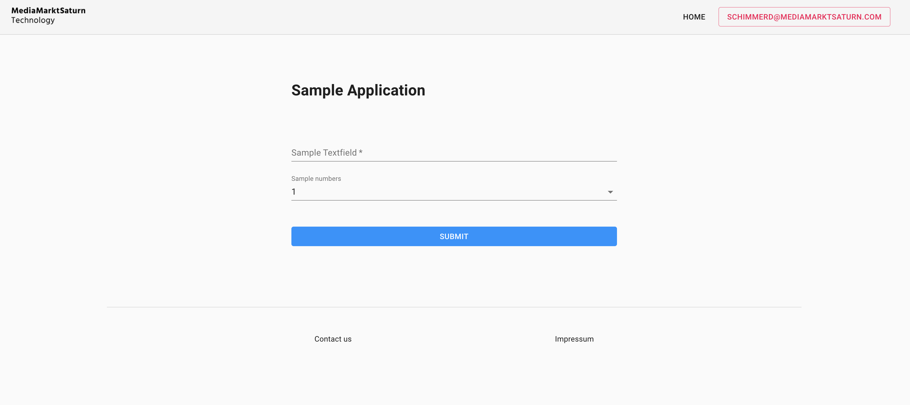

#### The template is based on the React JS library and Material-UI framework. 

Created with ```npx create-react-app $FOLDER_NAME```

<div>
  
</div>


## 1. Fundamentals

React.js is a JavaScript library for building user interfaces


You can build all sorts of single page applications. A React app is comprised of components, a lot of them, nested into one another. A component is a reusable piece of code, which defines how certain features should look and behave on the UI. For example, a button is a component.

JSX stands for JavaScript XML. JSX is JavaScript syntax extension. JSX allows us to write HTML

## 2. Development

````
npm install // install packages
npm start // start development server
````

Runs the app in the development mode.<br />
Open [http://localhost:3000](http://localhost:3000) to view it in the browser.

The page will reload if you make edits.<br />
You will also see any lint errors in the console.


### 1.1. Code structure

As you can see the very first directory is ```node_modules``` and this is having all the library dependency of ```package.json```.

Inside this directory, you will also find ```manifest.json```. This file is for PWAs — Progressive Web Apps.

The next one is the src director and contains all our React code. This is having ```layouts/default.js``` (base file), which is the first component, which will get rendered when we run our application. ```Index.js``` is having ```ReactDOM.render()``` method and will actually render the ```index.html’s``` root div. It will replace this root div with the app component.

```
ReactDOM.render(
    <Router history={hist}>
      <Switch>
        <Route path="/sample" component={Default} />
        <Redirect from="/" to="/sample/home" />
      </Switch>
    </Router>,
    document.getElementById('root')
)
```

The declarative routing approach allows you to control the data flow in your application. 

The ```views``` directory contains all fundamental components of the app. A View is basically a 'container', which contains one or more reusable components. Each view in an application should have a URL that uniquely specifies that view. 

A component is a small reusable chunk of code. Components are the core building block of React apps and placed in the ```components``` folder.

To ensure that only authenticated user are able to see 'private' components, we have to configure an ```auth-flow (middleware/auth.js)```, who controlls the users access.

For a better reusability you will find all neccassary stuff you will need to call API's in the ```api``` folder (based on axios)

The last folder contains all ```assets```, which are neccassary to fill the app with nice styles, images etc. 

#### root files: 
- .gitignore
- .dockerignore 
- .eslintignore
- .eslintrc (linter to avoiding bugs)
- .babelrc (toolchain to convert code into backwards compatible js versions - mainly for older browser)
- cloudbuild.yaml (CI/CD configuration)
- Dockerfile (creates the container image)
- jsconfig.json (optimizes imports)
- nginx.conf (server configuration)

### 1.2. Google Login

To add a new Google Sign-In, follow these steps:

1. Create authorization credentials: 

    Any application that uses OAuth 2.0 to access Google APIs must have authorization credentials that identify the application to Google's OAuth 2.0 server. The following steps explain how to create credentials for your project. Your applications can then use the credentials to access APIs that you have enabled for that project.

    - Go to the Credentials page.
    - Click on OAuth Consent Screent and create a new app
    - Click Create credentials > OAuth client ID.
    - Select the Web application application type.
    - Name your OAuth 2.0 client and click Create

    After configuration is complete, take note of the client ID that was created. You will need the client ID to complete the next steps. (A client secret is also created, but you need it only for server-side operations.)

2. Add the ```react-google-login``` component to your app - ```layouts/Default.js```: 

    https://www.npmjs.com/package/react-google-login

    ```
    <GoogleLogin
        clientId={clientId}
        buttonText="Login with Google "
        scope="https://www.googleapis.com/auth/cloud-platform https://www.googleapis.com/auth/cloud-platform.read-only"
        onSuccess={res => handleSuccess(res)}
        onFailure={res => handleFailure(res)}
        cookiePolicy={"single_host_origin"}
    /> 
    ```

## 2. Deployment

### 2.1. Manual

```
gcloud builds submit --tag gcr.io/$PROJECT_ID/$APP_NAME

gcloud beta run deploy --image gcr.io/$PROJECT_ID/APP_NAME --concurrency 10 --platform managed --region europe-west1 --memory 2Gi --allow-unauthenticated
```

### 2.2. Cloud Build

1. Create cloudbuild.yaml (specify service-name: $APP_NAME and project id: $PROJECT_ID)

2. IAM: "...@cloudbuild.gserviceaccount.com" needs Cloud Run Admin and Service Account User rights

3. Create Cloud Build Trigger on the Repository

After that, every push to master (or other specified branch or tag) creates a new version of the Cloud Run service.

For more information see https://cloud.google.com/run/docs/continuous-deployment

## Learn More

You can learn more in the [Create React App documentation](https://facebook.github.io/create-react-app/docs/getting-started).

To learn React, check out the [React documentation](https://reactjs.org/).

<hr />

Dominik Schimmer - 07.07.2020

